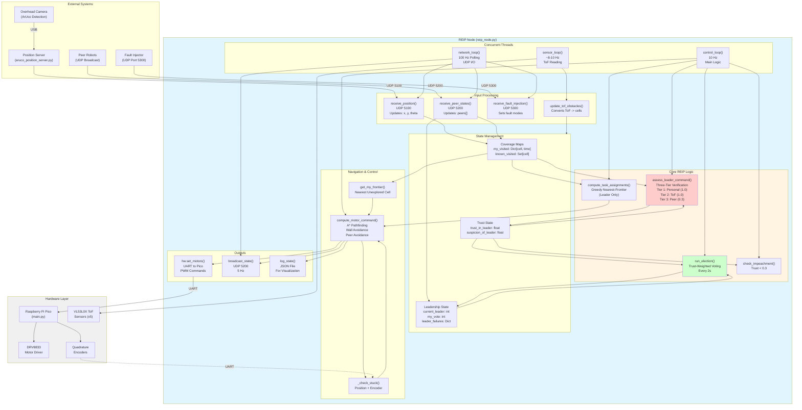
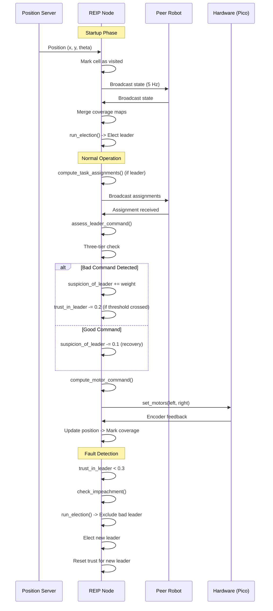

# REIP System Architecture Diagram

## Mermaid Diagram (Renders in GitHub/Markdown)



## Detailed Component Diagram (Mermaid)

```mermaid
graph LR
    subgraph "REIP Node Architecture"
        A[Position Server<br/>UDP 5100] -->|x, y, theta| B[receive_position]
        B --> C[Coverage Tracking<br/>my_visited<br/>known_visited]
        
        D[Peer Broadcasts<br/>UDP 5200] -->|state messages| E[receive_peer_states]
        E --> F[update_peer]
        F --> C
        F --> G[Peer State<br/>peers[]]
        
        H[ToF Sensors] -->|distances| I[read_tof_all]
        I --> J[update_tof_obstacles]
        J --> K[tof_obstacles Set]
        
        L[Fault Injector<br/>UDP 5300] -->|fault modes| M[receive_fault_injection]
        M --> N[bad_leader_mode<br/>oscillate_leader_mode<br/>freeze_leader_mode]
        
        C --> O[assess_leader_command<br/>Three-Tier Trust]
        K --> O
        G --> O
        N --> P[compute_task_assignments]
        
        O --> Q[Trust State<br/>trust_in_leader<br/>suspicion_of_leader]
        Q --> R[check_impeachment]
        Q --> S[run_election]
        R --> S
        S --> T[Leadership State<br/>current_leader<br/>my_vote]
        
        T --> P
        C --> P
        G --> P
        P --> U[leader_assigned_target]
        
        U --> V[compute_motor_command]
        C --> W[get_my_frontier]
        W --> V
        K --> V
        G --> V
        V --> X[hw.set_motors<br/>left, right PWM]
        
        V --> Y[broadcast_state<br/>UDP 5200]
        Y --> D
    end

    style O fill:#ffcccc
    style S fill:#ccffcc
    style P fill:#ccccff
    style V fill:#ffffcc
```

## ASCII Text Diagram

```
┌─────────────────────────────────────────────────────────────────────────────┐
│                         REIP SYSTEM ARCHITECTURE                              │
└─────────────────────────────────────────────────────────────────────────────┘

EXTERNAL SYSTEMS
┌─────────────────┐      ┌─────────────────┐      ┌─────────────────┐
│ Overhead Camera │      │  Peer Robots    │      │ Fault Injector  │
│  (ArUco Tags)   │      │  (UDP 5200)     │      │  (UDP 5300)     │
└────────┬────────┘      └────────┬────────┘      └────────┬────────┘
         │                        │                        │
         │ USB                    │                        │
                                 │                        │
┌─────────────────┐              │                        │
│ Position Server │              │                        │
│ (PC/Laptop)     │              │                        │
│ UDP 5100        │              │                        │
└────────┬────────┘              │                        │
         │                        │                        │
         └────────────────────────┼────────────────────────┘
                                  │
                                  
┌─────────────────────────────────────────────────────────────────────────────┐
│                          REIP NODE (reip_node.py)                            │
├─────────────────────────────────────────────────────────────────────────────┤
│                                                                              │
│  CONCURRENT THREADS                                                          │
│  ┌──────────────┐  ┌──────────────┐  ┌──────────────┐                     │
│  │ sensor_loop  │  │ network_loop │  │control_loop  │                     │
│  │ ~8-10 Hz     │  │ 100 Hz poll  │  │ 10 Hz        │                     │
│  └──────┬───────┘  └──────┬───────┘  └──────┬───────┘                     │
│         │                 │                  │                              │
│                                                                          │
│  ┌──────────────┐  ┌──────────────┐  ┌──────────────┐                     │
│  │ read_tof_all │  │receive_pos   │  │assess_leader │                     │
│  │              │  │receive_peer  │  │_command()    │                     │
│  │              │  │receive_fault │  │              │                     │
│  │              │  │broadcast_    │  │run_election()│                     │
│  │              │  │state()        │  │              │                     │
│  └──────┬───────┘  └──────┬───────┘  │compute_motor │                     │
│         │                 │           │_command()    │                     │
│                                     └──────┬───────┘                     │
│  ┌──────────────┐  ┌──────────────┐         │                              │
│  │update_tof_   │  │update_peer() │         │                              │
│  │obstacles()   │  │              │         │                              │
│  └──────┬───────┘  └──────┬───────┘         │                              │
│         │                 │                  │                              │
│         └─────────────────┼──────────────────┘                              │
│                           │                                                 │
│                                                                            │
│  ┌──────────────────────────────────────────────────────────┐              │
│  │              STATE MANAGEMENT                            │              │
│  ├──────────────────────────────────────────────────────────┤              │
│  │                                                           │              │
│  │  Coverage Maps:                                          │              │
│  │    • my_visited: Dict[cell, timestamp]                   │              │
│  │    • known_visited: Set[cell]                           │              │
│  │    • known_visited_time: Dict[cell, timestamp]           │              │
│  │                                                           │              │
│  │  Trust State:                                            │              │
│  │    • trust_in_leader: float [0.0, 1.0]                   │              │
│  │    • suspicion_of_leader: float                          │              │
│  │    • bad_commands_received: int                          │              │
│  │                                                           │              │
│  │  Leadership State:                                        │              │
│  │    • current_leader: Optional[int]                       │              │
│  │    • my_vote: Optional[int]                               │              │
│  │    • leader_failures: Dict[int, int]                    │              │
│  │                                                           │              │
│  │  Peer State:                                             │              │
│  │    • peers: Dict[int, PeerInfo]                          │              │
│  │      - x, y, theta, trust_score, vote, etc.              │              │
│  │                                                           │              │
│  │  Sensor State:                                           │              │
│  │    • tof: Dict[str, int]  (sensor_name: distance_mm)    │              │
│  │    • tof_obstacles: Set[cell]                            │              │
│  └──────────────────────────────────────────────────────────┘              │
│                           │                                                 │
│                                                                            │
│  ┌──────────────────────────────────────────────────────────┐              │
│  │         CORE REIP PROCESSES                              │              │
│  ├──────────────────────────────────────────────────────────┤              │
│  │                                                           │              │
│  │  1. TRUST ASSESSMENT (assess_leader_command)             │              │
│  │     ┌─────────────────────────────────────┐              │              │
│  │     │ Three-Tier Verification:           │              │              │
│  │     │  Tier 1: Personal visit (weight 1.0)│              │              │
│  │     │  Tier 2: ToF obstacle (weight 1.0) │              │              │
│  │     │  Tier 3: Peer report (weight 0.3)  │              │              │
│  │     │                                       │              │              │
│  │     │ MPC Direction Check:                 │              │              │
│  │     │  Command vs. nearest frontier      │              │              │
│  │     │                                       │              │              │
│  │     │ Updates: suspicion_of_leader       │              │              │
│  │     │          trust_in_leader (on threshold)│              │              │
│  │     └─────────────────────────────────────┘              │              │
│  │                                                           │              │
│  │  2. ELECTION (run_election)                               │              │
│  │     ┌─────────────────────────────────────┐              │              │
│  │     │ Build candidates (trust > 0.5)     │              │              │
│  │     │ Sort by: trust, failures, id        │              │              │
│  │     │ Count votes from peers              │              │              │
│  │     │ Elect winner                        │              │              │
│  │     │ Update: current_leader, my_vote     │              │              │
│  │     └─────────────────────────────────────┘              │              │
│  │                                                           │              │
│  │  3. TASK ASSIGNMENT (compute_task_assignments)          │              │
│  │     ┌─────────────────────────────────────┐              │              │
│  │     │ Find frontiers (unexplored cells)   │              │              │
│  │     │ Greedy nearest-frontier assignment │              │              │
│  │     │ Spatial diversity (both rooms)     │              │              │
│  │     │ Returns: {robot_id: (x, y)}        │              │              │
│  │     └─────────────────────────────────────┘              │              │
│  │                                                           │              │
│  │  4. NAVIGATION (compute_motor_command)                    │              │
│  │     ┌─────────────────────────────────────┐              │              │
│  │     │ Get target (leader assignment OR   │              │              │
│  │     │              local frontier)        │              │              │
│  │     │ A* pathfinding                      │              │              │
│  │     │ Wall avoidance                      │              │              │
│  │     │ Peer avoidance                      │              │              │
│  │     │ Stuck detection & escape            │              │              │
│  │     │ Returns: (left_pwm, right_pwm)      │              │              │
│  │     └─────────────────────────────────────┘              │              │
│  └──────────────────────────────────────────────────────────┘              │
│                           │                                                 │
│                                                                            │
│  ┌──────────────────────────────────────────────────────────┐              │
│  │                    OUTPUTS                               │              │
│  ├──────────────────────────────────────────────────────────┤              │
│  │  • hw.set_motors(left, right) -> UART -> Pico             │              │
│  │  • broadcast_state() -> UDP 5200 -> Peers                  │              │
│  │  • log_state() -> JSON file -> Visualization              │              │
│  └──────────────────────────────────────────────────────────┘              │
└─────────────────────────────────────────────────────────────────────────────┘
                                  │
                                  
┌─────────────────────────────────────────────────────────────────────────────┐
│                         HARDWARE LAYER                                       │
├─────────────────────────────────────────────────────────────────────────────┤
│                                                                              │
│  ┌──────────────┐      ┌──────────────┐      ┌──────────────┐              │
│  │ Pi Pico      │      │ DRV8833      │      │ VL53L0X ToF  │              │
│  │ (main.py)    │      │ Motor Driver │      │ Sensors (x5) │              │
│  │              │      │              │      │              │              │
│  │ • PWM Gen    │─────│ • Left Motor │      │ • Front      │              │
│  │ • Encoder    │      │ • Right Motor│      │ • Front-L    │              │
│  │   Reading    │      │              │      │ • Front-R     │              │
│  │              │      │              │      │ • Left        │              │
│  │ UART 115200  │      └──────────────┘      │ • Right      │              │
│  └──────┬───────┘                            └──────────────┘              │
│         │                                                                    │
│         │ UART                                                               │
│         │                                                                    │
│         └───────────────────────────────────────────────────────────────────┘
└─────────────────────────────────────────────────────────────────────────────┘
```

## Data Flow Sequence Diagram



## How to Use These Diagrams

### Option 1: Mermaid (Recommended for GitHub/Markdown)
- Copy the Mermaid code blocks above
- Paste into any Markdown file (GitHub will render automatically)
- Or use [Mermaid Live Editor](https://mermaid.live) to export as PNG/SVG

### Option 2: Draw.io / diagrams.net
1. Go to [diagrams.net](https://app.diagrams.net/)
2. Create new diagram
3. Use the ASCII diagram above as a reference
4. Create boxes for each component
5. Connect with arrows showing data flow

### Option 3: PlantUML
- Similar to Mermaid, text-based
- Good for sequence diagrams
- Can export to PNG/SVG

### Option 4: PowerPoint/Keynote
- Use the ASCII diagram as a template
- Create boxes and arrows manually
- Good for presentations

## Key Components to Highlight

1. **Three Concurrent Threads**: sensor_loop, network_loop, control_loop
2. **Core REIP Processes**: Trust assessment, Election, Task assignment, Navigation
3. **State Management**: Coverage maps, Trust state, Leadership state
4. **External Interfaces**: Position server, Peer communication, Fault injection
5. **Hardware Layer**: Pico, Motors, ToF sensors, Encoders

## Color Coding Suggestions

- **Blue**: Input/Output interfaces
- **Yellow**: Core REIP logic (trust, election)
- **Green**: State management
- **Orange**: Navigation/Control
- **Gray**: Hardware layer
