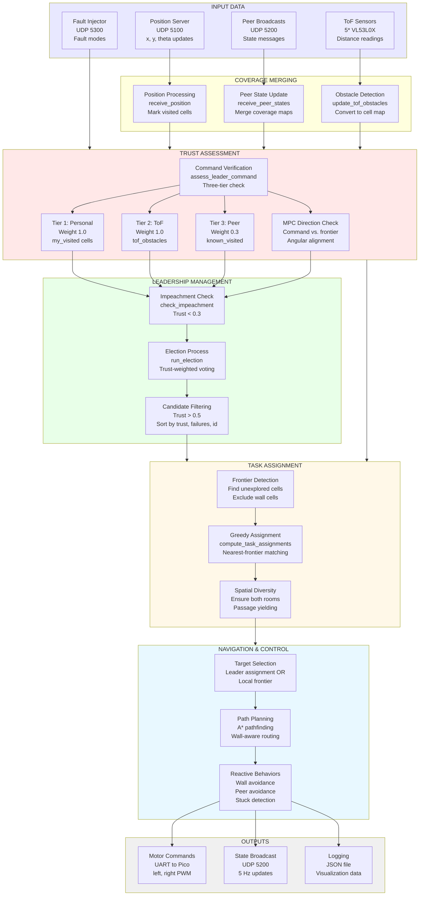

# REIP System Architecture Diagrams (Academic Style)

## Figure 1: REIP Governance Pipeline



## Figure 2: REIP Trust Assessment Architecture

```mermaid
graph TB
    subgraph Phase1["Phase 1: Evidence Collection"]
        A[Leader Assignment<br/>commanded_target<br/>x, y coordinates]
        B[Local Knowledge Base]
        C[Personal Visits<br/>my_visited: Dict[cell, time]<br/>Weight: 1.0]
        D[ToF Obstacles<br/>tof_obstacles: Set[cell]<br/>Weight: 1.0]
        E[Peer Reports<br/>known_visited: Set[cell]<br/>Weight: 0.3]
        
        A --> F[Cell Extraction<br/>get_cell x, y]
        F --> B
        B --> C
        B --> D
        B --> E
    end

    subgraph Phase2["Phase 2: Causality-Aware Verification"]
        G[Causality Check<br/>assignment_time - grace_period<br/>Prevents false positives]
        H[Tier 1 Check<br/>cell in my_visited?<br/>visited_time < cutoff?]
        I[Tier 2 Check<br/>dist <= 200mm AND<br/>cell in tof_obstacles?]
        J[Tier 3 Check<br/>cell in known_visited?<br/>known_time < cutoff?]
        
        C --> G
        G --> H
        D --> I
        E --> G
        G --> J
    end

    subgraph Phase3["Phase 3: Direction Consistency"]
        K[MPC Direction Check<br/>_compute_mpc_direction_error]
        L[Find Unexplored Cells<br/>Frontiers]
        M[Compute Alignment<br/>cmd_dir vs. frontier_dir<br/>Best match]
        N[Severity Classification<br/>Severe: >135deg<br/>Moderate: 90-135deg]
        
        A --> K
        K --> L
        L --> M
        M --> N
    end

    subgraph Phase4["Phase 4: Suspicion Accumulation"]
        O[Suspicion Update<br/>suspicion += weight<br/>OR<br/>suspicion -= recovery_rate]
        P[Threshold Check<br/>suspicion >= 1.5?]
        Q[Trust Decay<br/>trust -= 0.2<br/>suspicion -= 1.5 carry-over]
        R[Detection Metrics<br/>first_bad_command_time<br/>first_decay_time<br/>bad_commands_received]
        
        H --> O
        I --> O
        J --> O
        N --> O
        O --> P
        P --> Q
        Q --> R
    end

    H --> Phase4
    I --> Phase4
    J --> Phase4
    N --> Phase4

    style Phase1 fill:#e8e8ff
    style Phase2 fill:#ffe8e8
    style Phase3 fill:#fff8e8
    style Phase4 fill:#e8ffe8
```

## Figure 3: REIP Node Internal Architecture

```mermaid
graph TB
    subgraph Threads["Concurrent Execution Threads"]
        T1[sensor_loop<br/>~8-10 Hz<br/>ToF Reading]
        T2[network_loop<br/>100 Hz Polling<br/>UDP I/O]
        T3[control_loop<br/>10 Hz<br/>Main Logic]
    end

    subgraph State["Shared State (Thread-Safe)"]
        S1[Coverage Maps<br/>my_visited: Dict[cell, time]<br/>known_visited: Set[cell]<br/>known_visited_time: Dict]
        S2[Trust State<br/>trust_in_leader: float [0,1]<br/>suspicion_of_leader: float<br/>bad_commands_received: int]
        S3[Leadership State<br/>current_leader: Optional[int]<br/>my_vote: Optional[int]<br/>leader_failures: Dict[int, int]]
        S4[Peer State<br/>peers: Dict[int, PeerInfo]<br/>x, y, theta, trust, vote]
        S5[Sensor State<br/>tof: Dict[str, int]<br/>tof_obstacles: Set[cell]]
        S6[Assignment State<br/>leader_assigned_target: Tuple<br/>my_assigned_target: Tuple<br/>assignment_rx_mono: float]
    end

    subgraph Functions["Core Functions"]
        F1[receive_position<br/>Updates: S1, x, y, theta]
        F2[receive_peer_states<br/>Updates: S1, S4, S6]
        F3[update_tof_obstacles<br/>Updates: S5]
        F4[assess_leader_command<br/>Reads: S1, S5, S6<br/>Updates: S2]
        F5[run_election<br/>Reads: S2, S3, S4<br/>Updates: S3]
        F6[compute_task_assignments<br/>Reads: S1, S4<br/>Updates: S6]
        F7[compute_motor_command<br/>Reads: S1, S4, S5, S6<br/>Outputs: PWM]
    end

    T1 --> F3
    T2 --> F1
    T2 --> F2
    T2 --> F7
    T3 --> F4
    T3 --> F5
    T3 --> F6
    T3 --> F7

    F1 --> S1
    F2 --> S1
    F2 --> S4
    F2 --> S6
    F3 --> S5
    F4 --> S2
    F5 --> S3
    F6 --> S6

    S1 --> F4
    S1 --> F6
    S1 --> F7
    S2 --> F4
    S2 --> F5
    S3 --> F5
    S4 --> F5
    S4 --> F6
    S4 --> F7
    S5 --> F4
    S5 --> F7
    S6 --> F4
    S6 --> F7

    style Threads fill:#e8e8ff
    style State fill:#fff8e8
    style Functions fill:#e8ffe8
```

## ASCII Version (For LaTeX/Paper)

```
┌─────────────────────────────────────────────────────────────────────────────┐
│                    REIP GOVERNANCE PIPELINE                                  │
└─────────────────────────────────────────────────────────────────────────────┘

INPUT DATA
┌──────────────┐  ┌──────────────┐  ┌──────────────┐  ┌──────────────┐
│   Position   │  │    Peer      │  │     ToF      │  │    Fault     │
│    Server    │  │  Broadcasts  │  │   Sensors    │  │   Injector   │
│  UDP 5100    │  │  UDP 5200    │  │   5* VL53L0X │  │  UDP 5300    │
└──────┬───────┘  └──────┬───────┘  └──────┬───────┘  └──────┬───────┘
       │                 │                 │                 │
                                                          

COVERAGE MERGING
┌──────────────────────────────────────────────────────────────────┐
│  Position Processing    │  Peer State Update    │  Obstacle Detection │
│  • Mark visited cells   │  • Merge coverage    │  • Convert to cells │
│  • Update my_visited    │  • Update peers[]    │  • Update tof_obs  │
└──────────────────────────────────────────────────────────────────┘
       │                 │                 │
       └─────────────────┼─────────────────┘
                         

TRUST ASSESSMENT (assess_leader_command)
┌──────────────────────────────────────────────────────────────────┐
│                                                                  │
│  Three-Tier Verification:                                        │
│  ┌──────────────┐  ┌──────────────┐  ┌──────────────┐          │
│  │  Tier 1:     │  │  Tier 2:     │  │  Tier 3:     │          │
│  │  Personal    │  │  ToF         │  │  Peer        │          │
│  │  Weight 1.0  │  │  Weight 1.0  │  │  Weight 0.3  │          │
│  └──────┬───────┘  └──────┬───────┘  └──────┬───────┘          │
│         │                 │                 │                   │
│         └─────────────────┼─────────────────┘                   │
│                                                                │
│  MPC Direction Check:                                            │
│  • Command vs. nearest frontier                                  │
│  • Angular alignment (>135deg severe, 90-135deg moderate)         │
│                                                                  │
│  Output: suspicion_of_leader += weight                          │
│          OR suspicion_of_leader -= recovery_rate                │
│          IF suspicion >= 1.5: trust -= 0.2                        │
└──────────────────────────────────────────────────────────────────┘
                         │
                         

LEADERSHIP MANAGEMENT
┌──────────────────────────────────────────────────────────────────┐
│  Impeachment Check          │  Election Process                 │
│  • Trust < 0.3?             │  • Build candidates (trust > 0.5)│
│  • Exclude from candidates  │  • Sort by trust, failures, id    │
│                             │  • Count votes                    │
│                             │  • Elect winner                   │
└──────────────────────────────────────────────────────────────────┘
                         │
                         

TASK ASSIGNMENT (Leader Only)
┌──────────────────────────────────────────────────────────────────┐
│  Frontier Detection    │  Greedy Assignment    │  Spatial Diversity │
│  • Find unexplored     │  • Nearest-frontier   │  • Both rooms      │
│  • Exclude walls       │  • Distance sorting  │  • Passage yield  │
└──────────────────────────────────────────────────────────────────┘
                         │
                         

NAVIGATION & CONTROL
┌──────────────────────────────────────────────────────────────────┐
│  Target Selection    │  Path Planning    │  Reactive Behaviors   │
│  • Leader assignment │  • A* routing     │  • Wall avoidance     │
│  • OR local frontier │  • Wall-aware     │  • Peer avoidance     │
│                      │                   │  • Stuck detection    │
└──────────────────────────────────────────────────────────────────┘
                         │
                         

OUTPUTS
┌──────────────┐  ┌──────────────┐  ┌──────────────┐
│    Motor     │  │    State     │  │   Logging    │
│  Commands    │  │  Broadcast   │  │   JSON File  │
│  UART->Pico  │  │  UDP 5200    │  │              │
└──────────────┘  └──────────────┘  └──────────────┘
```

## LaTeX/TikZ Style (For Paper)

For inclusion in your LaTeX paper, you can use the TikZ package. Here's a template:

```latex
\begin{figure*}[t]
\centering
\begin{tikzpicture}[
    box/.style={rectangle, draw, fill=blue!20, text width=3cm, text centered, minimum height=1cm},
    process/.style={rectangle, draw, fill=green!20, text width=3cm, text centered, minimum height=1cm},
    arrow/.style={->, >=stealth, thick}
]
    % Input boxes
    \node[box] (pos) at (0,0) {Position Server};
    \node[box] (peer) at (3,0) {Peer Broadcasts};
    \node[box] (tof) at (6,0) {ToF Sensors};
    
    % Process boxes
    \node[process] (merge) at (3,-2) {Coverage Merging};
    \node[process] (trust) at (3,-4) {Trust Assessment};
    \node[process] (elect) at (3,-6) {Election};
    \node[process] (assign) at (3,-8) {Task Assignment};
    \node[process] (nav) at (3,-10) {Navigation};
    
    % Output box
    \node[box] (out) at (3,-12) {Motor Commands};
    
    % Arrows
    \draw[arrow] (pos) -- (merge);
    \draw[arrow] (peer) -- (merge);
    \draw[arrow] (tof) -- (merge);
    \draw[arrow] (merge) -- (trust);
    \draw[arrow] (trust) -- (elect);
    \draw[arrow] (elect) -- (assign);
    \draw[arrow] (assign) -- (nav);
    \draw[arrow] (nav) -- (out);
\end{tikzpicture}
\caption{REIP Governance Pipeline: Data flows from external inputs through coverage merging, trust assessment, leadership management, task assignment, and navigation to motor commands.}
\label{fig:reip_pipeline}
\end{figure*}
```
